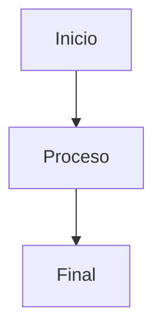

import Tabs from '@theme/Tabs';
import TabItem from '@theme/TabItem';


# 🚀 Bienvenido a la documentación

Aquí encontrarás toda la información necesaria para empezar.


# Título Principal
## Subtítulo
### Sub-subtítulo

**Negrita**, *cursiva*, ~~tachado~~.

[Enlace](https://docusaurus.io)

> Cita o bloque de referencia.

- Lista de elementos
- Otro elemento
  - Sub-elemento

## Tablas

| Nombre  | Edad | Ciudad      |
|---------|------|------------|
| Juan    | 28   | Bogotá     |
| María   | 25   | Buenos Aires |
| Pedro   | 30   | Madrid     |


```javascript
const mensaje = "Hola, VML";
console.log(mensaje);
```

```python {1,3}
def saludar():
    print("Hola, Docusaurus!")
saludar()
```

:::tip Consejo
Puedes usar Docusaurus para documentar cualquier proyecto, ¡no solo código!
:::

:::note Información
Docusaurus soporta Markdown y MDX, lo que lo hace muy flexible.
:::

:::warning Advertencia
Asegúrate de reiniciar el servidor después de hacer cambios en `docusaurus.config.js`.
:::

:::danger Peligro
No elimines archivos del directorio `build/` sin saber lo que haces.
:::

## Tabs

<Tabs>
  <TabItem value="js" label="JavaScript">
    ```javascript
    console.log("Hola desde JavaScript");
    ```
  </TabItem>
  <TabItem value="py" label="Python">
    ```python
    print("Hola desde Python")
    ```
  </TabItem>
</Tabs>


## Imagenes


<div align="center">
  
</div>

## Diagramas



## Video

[](https://www.youtube.com/watch?v=dQw4w9WgXcQ)


### Video en un iframe

<iframe width="560" height="315" src="https://www.youtube.com/embed/dQw4w9WgXcQ" frameborder="0" allowfullscreen></iframe>


### Video de una fuente local

<video width="600" controls>
  <source src="/videos/mivideo.mp4" type="video/mp4" />
  Tu navegador no soporta la reproducción de videos.
</video>


## Audio

### Audio de una fuente externa

<iframe src="https://open.spotify.com/embed/track/1hKdDCpiI9mqz1jVHRKG0E" width="300" height="380" frameborder="0" allowtransparency="true" allow="encrypted-media"></iframe>


### Audio de una fuente local

<audio controls>
  <source src="/audios/mi_audio.mp3" type="audio/mp3" />
  Tu navegador no soporta la reproducción de audio.
</audio>


## Files (PDF, Excel, etc)


### De una fuente externa

📄 [Abrir Excel en SharePoint](https://wppcloud-my.sharepoint.com/:x:/r/personal/hernan_seco_vml_com/_layouts/15/Doc.aspx?sourcedoc=%7B6CA894B0-2BD6-4A2A-9F7B-05DFC396B0A7%7D)


### De una fuente local
static/docs/mi_archivo.pdf

📄 [Descargar PDF](./docs/mi_archivo.pdf)

